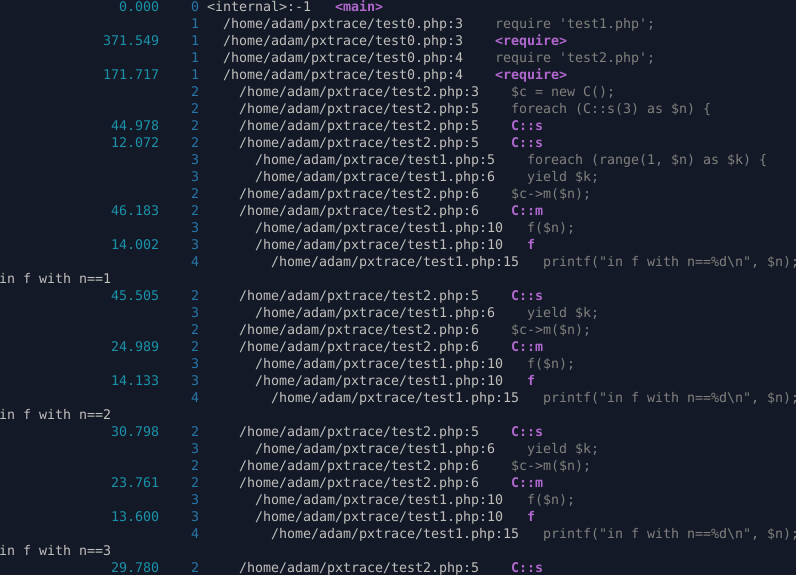

# pxtrace

Bash's `set -x` for PHP.

### Build

```console
$ phpize && ./configure && make
```

### Install

```console
$ make install
```

Add `zend_extension=pxtrace.so` to your php.ini.

### INI settings

* `pxtrace.auto_enable`: Automatically enable pxtrace for all requests (default `0`)
* `pxtrace.output_path`: File path or `@stdout` or `@stderr` for standard out (default `@stderr`)
* `pxtrace.trace_statements`: Trace statements (like `set -x` in Bash) (default `0`)
* `pxtrace.ansi_color`: Color output via ANSI escape codes (default `0`)

### Demo

```console
$ cat -n test0.php
     1    <?php declare(strict_types=1);
     2
     3    require 'test1.php';
     4    require 'test2.php';
$ cat -n test1.php
     1    <?php declare(strict_types=1);
     2
     3    class C {
     4        public static function s(int $n): Generator {
     5            foreach (range(1, $n) as $k) {
     6                yield $k;
     7            }
     8        }
     9        public function m(int $n): void {
    10            f($n);
    11        }
    12    }
    13
    14    function f(int $n): void {
    15        printf("in f with n==%d\n", $n);
    16    }
$ cat -n test2.php
     1    <?php declare(strict_types=1);
     2
     3    $c = new C();
     4
     5    foreach (C::s(3) as $n) {
     6        $c->m($n);
     7    }
$ php -d zend_extension=$(pwd)/modules/pxtrace.so -d pxtrace.auto_enable=1 -d pxtrace.output_path=@stdout -d pxtrace.trace_statements=1 test0.php
               0.000    0 <internal>:-1   <main>
                        1   /home/adam/pxtrace/test0.php:3    require 'test1.php';
             187.258    1   /home/adam/pxtrace/test0.php:3    <require>
                        1   /home/adam/pxtrace/test0.php:4    require 'test2.php';
              98.203    1   /home/adam/pxtrace/test0.php:4    <require>
                        2     /home/adam/pxtrace/test2.php:3    $c = new C();
                        2     /home/adam/pxtrace/test2.php:5    foreach (C::s(3) as $n) {
              59.443    2     /home/adam/pxtrace/test2.php:5    C::s
              17.011    2     /home/adam/pxtrace/test2.php:5    C::s
                        3       /home/adam/pxtrace/test1.php:5    foreach (range(1, $n) as $k) {
                        3       /home/adam/pxtrace/test1.php:6    yield $k;
                        2     /home/adam/pxtrace/test2.php:6    $c->m($n);
              65.348    2     /home/adam/pxtrace/test2.php:6    C::m
                        3       /home/adam/pxtrace/test1.php:10   f($n);
              22.505    3       /home/adam/pxtrace/test1.php:10   f
                        4         /home/adam/pxtrace/test1.php:15   printf("in f with n==%d\n", $n);
in f with n==1
              59.329    2     /home/adam/pxtrace/test2.php:5    C::s
                        3       /home/adam/pxtrace/test1.php:6    yield $k;
                        2     /home/adam/pxtrace/test2.php:6    $c->m($n);
              36.589    2     /home/adam/pxtrace/test2.php:6    C::m
                        3       /home/adam/pxtrace/test1.php:10   f($n);
              21.538    3       /home/adam/pxtrace/test1.php:10   f
                        4         /home/adam/pxtrace/test1.php:15   printf("in f with n==%d\n", $n);
in f with n==2
              44.926    2     /home/adam/pxtrace/test2.php:5    C::s
                        3       /home/adam/pxtrace/test1.php:6    yield $k;
                        2     /home/adam/pxtrace/test2.php:6    $c->m($n);
              35.385    2     /home/adam/pxtrace/test2.php:6    C::m
                        3       /home/adam/pxtrace/test1.php:10   f($n);
              21.510    3       /home/adam/pxtrace/test1.php:10   f
                        4         /home/adam/pxtrace/test1.php:15   printf("in f with n==%d\n", $n);
in f with n==3
              43.960    2     /home/adam/pxtrace/test2.php:5    C::s
```

### Screencap of `ansi_color` mode


